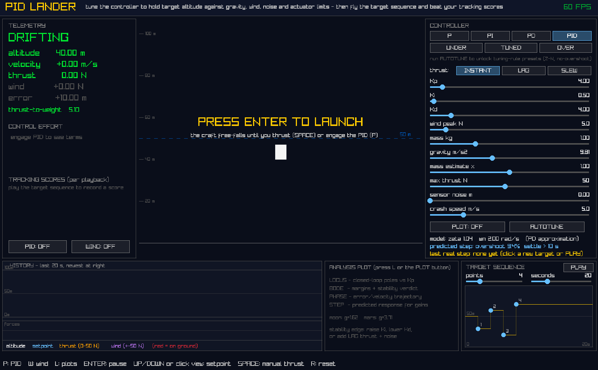

# PIDlander

A real-time 1-D flight control sandbox written in C99, built to demonstrate end-to-end classical control theory and deterministic simulation techniques.


<br>
<span style="font-size: 14px">Figure 1; Prelaunch screen with telemetry panels and PID control windows. Lander is simple white rectangle at image centre. Aim to control altitude settling with Kp, Kd and Ki.</span>

## Overview

PIDlander presents an interactive lunar-lander environment where thrust is governed by a user-designed PID controller. The primary constraint is a one-sided actuator (`u ≥ 0`); the controller possesses no downward authority other than gravity. This asymmetry necessitates a robust controller design to handle routine saturation, asymmetric overshoot recovery, and variable plant dynamics (mass, wind disturbances, sensor noise, and actuator lag).

The physics simulation runs on a decoupled, fixed 120 Hz timestep using semi-implicit Euler integration to prevent the slow energy injection typical of explicit methods, ensuring the numerical stability required for marginal-stability experiments. Rendering and UI are handled via `raylib`.


<br>
<span style="font-size: 14px">Figure 2; Brief sample of gameplay. Game is started with button press and manually controlled by user-presses on spacebar by default. PID control can be started by pressing 'P'. Control gain bars and telemtry are at left, history plot of altitude, wind force, thrust and altitude set at bottom. Toggle panel at right sets controls.</span>


<span style="font-size: 14px">Figure 3; Changing plots between bode, phase, root locus and step response</span>


<br>
<span style="font-size: 14px">Figure 4; Adjusting flight sequence, number of altitudes, timespan and altitude setting. Errors and effort are logged for plays on each sequence. Control weights can be adjusted and tested against known sequence.</span>

<a href="https://youtu.be/yYE1kUrhGyA" target="_blank">
  
</a>
<br>
<span style="font-size: 14px">Figure 5; Youtube vide of sample playing the sequence. Craft is landed successfully as displayed with m/s landing speed. Sequence can be rerun with different parameters.</span>

## Core Technical Features

* **Industrial PID Architecture:** The control law extends beyond textbook PID, implementing integrator anti-windup (conditional integration with bumpless tuning), derivative on measurement (to prevent setpoint kick), a discrete 50 ms first-order low-pass derivative filter, and gravity feedforward.
* **Live Frequency-Domain Analysis:** The console features real-time evaluation of the closed-loop system, including:
* Root locus tracking via a verified Cardano/trigonometric cubic solver.
* Complex Bode plots with advisory gain and phase margins.
* Phase portraits mapping error/velocity trajectories.
* Real-time linear closed-loop step response predictions compared against measured flight data.


* **Exact Stability Verification:** To catch conditionally stable loop shapes where phase margin heuristics fail, the system evaluates a generic Routh-Hurwitz array on the full 5th-order closed-loop characteristic polynomial, explicitly accounting for both the derivative filter and actuator lag.
* **Relay Autotuning:** Implements the Åström-Hägglund relay experiment. By forcing the plant into a controlled limit cycle, it extracts the ultimate gain and period to provide Ziegler-Nichols (PID/PI) and Tyreus-Luyben tuning presets.
* **Performance Scoring:** A mission sequence editor evaluates closed-loop tracking against standard indices: Integral Absolute Error (IAE), Time-weighted IAE (ITAE), peak error, and total control effort.

## Verification & Testing

The repository relies on headless testing to verify control math independently of the graphical loop.

* `make test`: Runs closed-loop metric tests, solver validation (cubic residuals, Routh vs. brute-force linear simulation), and ring-buffer integrity harnesses.
* `./lander --selftest`: Executes a full-application autonomous flight while cross-checking the telemetry ring buffer against a shadow copy to ensure memory integrity.

## Building

The project is written in C99 and requires `raylib`.
*(Note: On Windows via MSYS2, `raylib` is dynamically linked against `glfw3.dll`, so the required DLLs are staged beside the executable during the build process).*

```bash
make          # Build the main executable
make test     # Run the headless verification suite

```

## Further Reading

For a comprehensive post-mortem detailing the control theory math, the implementation of the numerical solvers, the handling of conditional stability, and the process of debugging a memory buffer overrun that masqueraded as corrupted physics data, please refer to the **[full project writeup here]**.